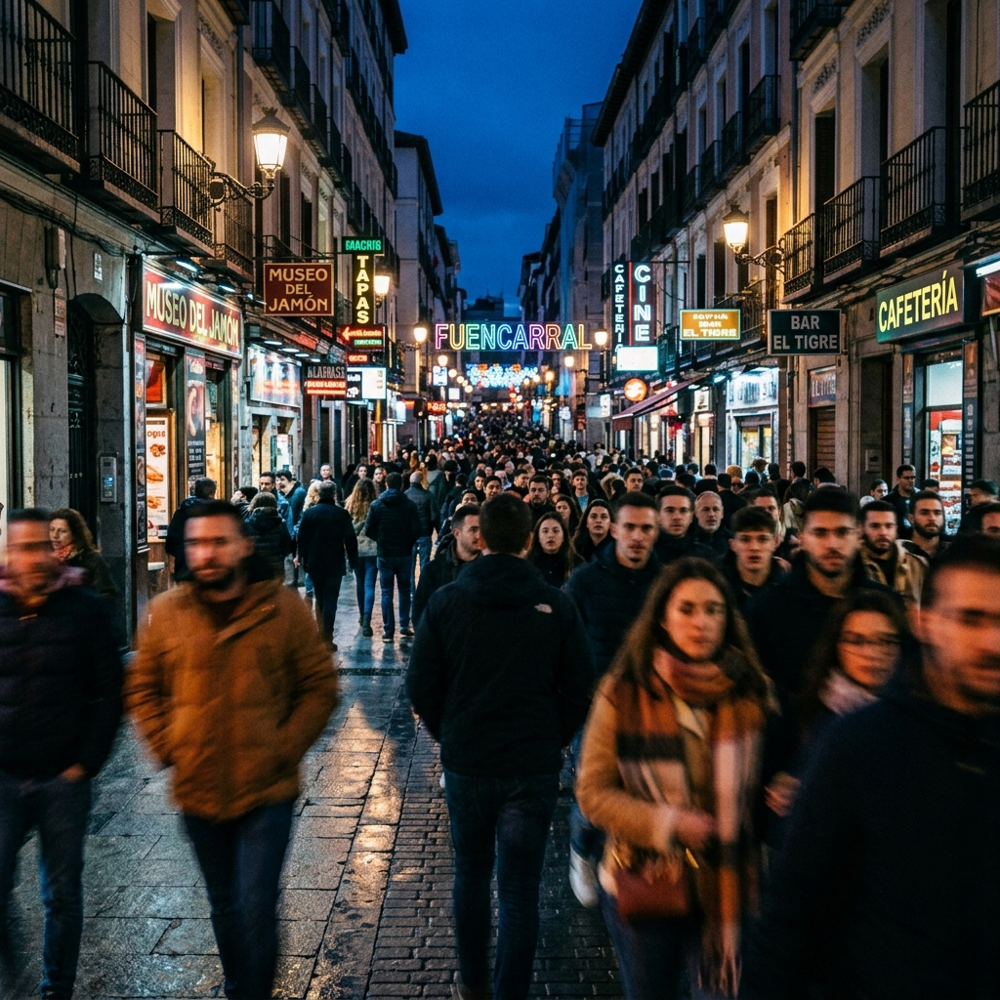
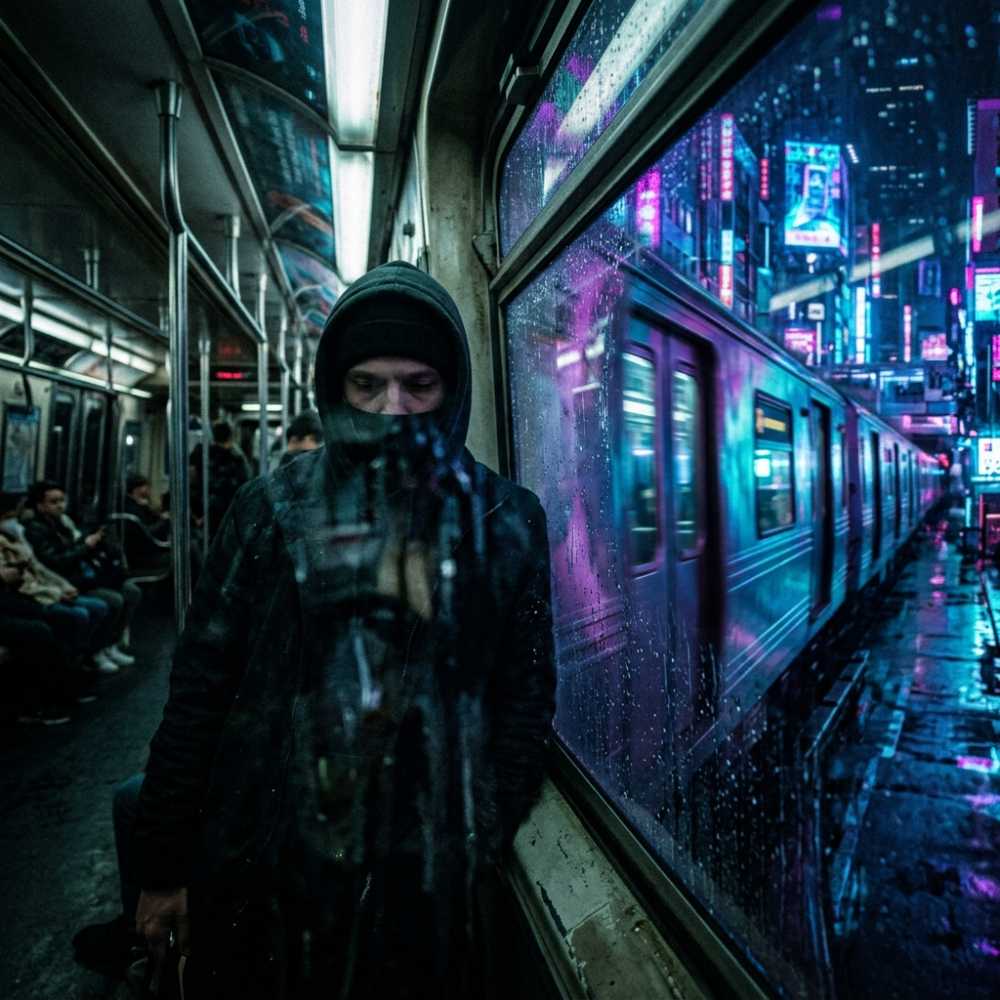
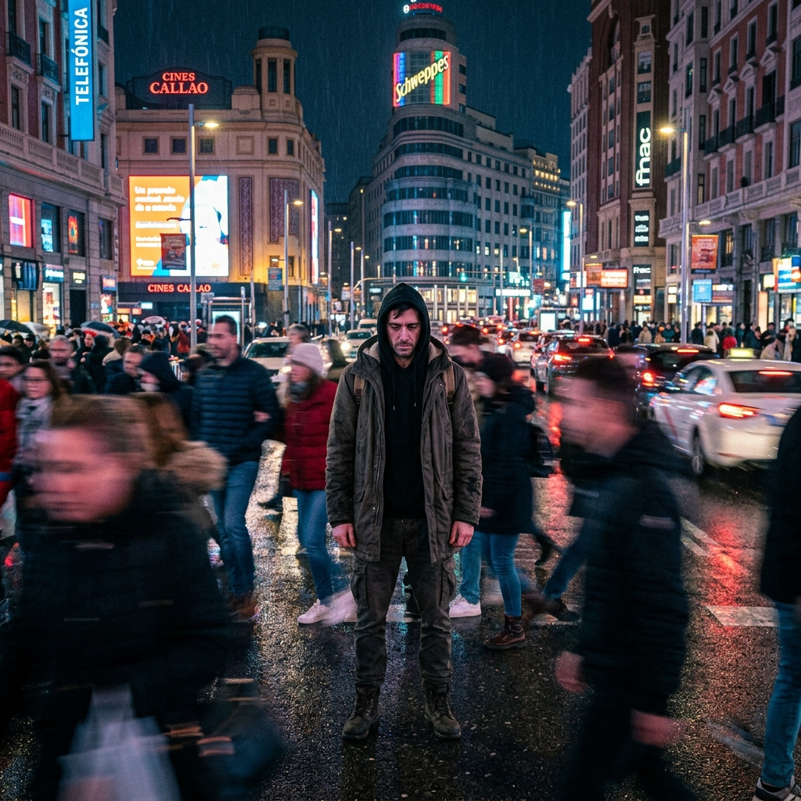
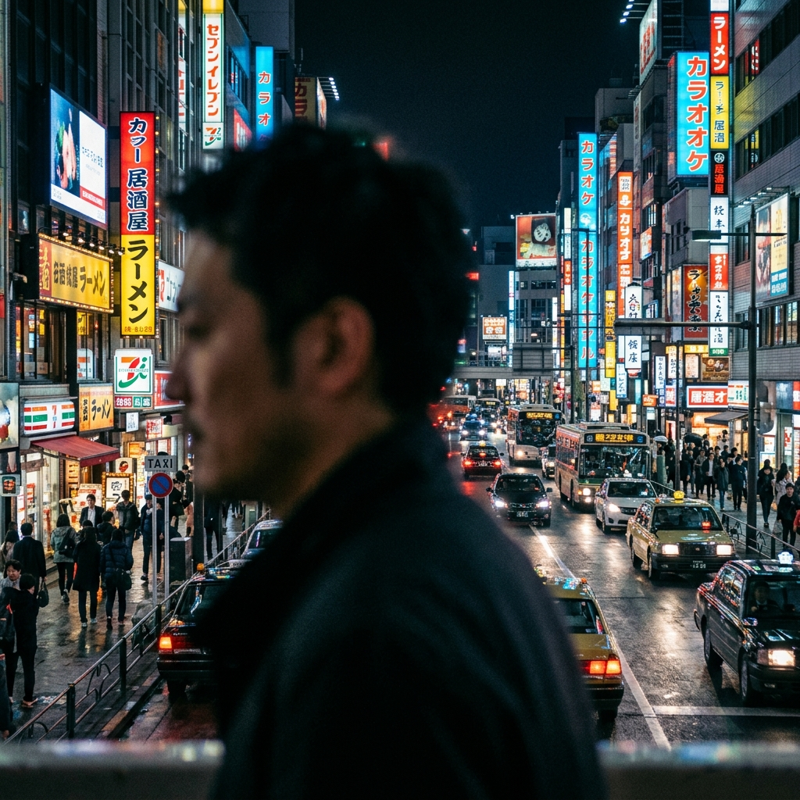

# Guion Técnico y Conceptual - Videoclip "NADA"

**Artista:** Eddy Castaño
**Tema:** NADA
**Presupuesto:** 0$ (Guerrilla Filmmaking)
**Equipo:** iPhone 13 (Modo Cine) + Trípode básico / Apoyo urbano.
**Concepto Principal:** P.O.V (Vista en 1ª persona) + "La Estatua" (Aislamiento en medio del caos).
**Vibra:** Melancolía, Electro Funk / Chillout, Desconexión urbana.

---

## 📸 1. Directrices Técnicas (iPhone 13) y Mejoras Sugeridas

El Modo Cine del iPhone 13 es excelente, pero sufre en baja luz y con movimientos rápidos. Aquí tienes cómo llevar el plan original al siguiente nivel:

*   **AE/AF Lock (Foco y Exposición):** ¡Fundamental! Pero **CUIDADO con la exposición nocturna**. En Callao, los neones engañan a la cámara. Baja manualmente un poco el "solcito" (la exposición) al bloquear el foco para que los negros se vean oscuros y no grises/granulados.
*   **F-Stop Óptimo:** f/2.8 a f/4.0 es perfecto. Evita abrir más de f/2.8 en Gran Vía, o el iPhone se confundirá con las luces traseras de los coches y el recorte de tu cabeza fallará.
*   **Gestión del Movimiento (Estatua):** Para que "La Estatua" impacte de verdad, no pestañees ni respires fuerte. Si en edición aceleras el vídeo un 150% o 200%, la gente pasará como un borrón (Motion Blur) y tú te verás estático, aumentando brutalmente el dramatismo sin efectos especiales.
*   **La trampa del Metro:** En el Metro de Madrid (Atocha/Sol), sacar un trípode grande atrae a seguridad. Usa un trípode de mano (tipo GorillaPod) o apoya el móvil en una barandilla/papelera.

---

## 🎬 2. Desglose del Guion Mejorado (Letra a Letra)

### BLOQUE 1: INTRO Y VERSO 1 (Introspección y P.O.V.)
*Vibra Chillout, cámara en mano en 1ª persona.*

*   *"La vida me empuja, sin preguntar."*
    *   **Toma P.O.V.:** Caminando rápido por Calle Preciados. **Mejora:** Camina a contraflujo (chocando casi de frente con la gente que viene hacia ti) para acentuar el "me empuja". Graba a 60fps y ralentízalo para darle un toque onírico.
    *   
*   *"Dejé mis zapatos, en otro lugar."*
    *   **Toma P.O.V. (Reflejo Distorsionado):** La cámara mira tu propio reflejo en el cristal mojado de la ventanilla de un vagón del metro. **Mejora:** Mientras miras el reflejo, un tren pasa a toda velocidad por el andén de enfrente, borrando tu imagen por un segundo. Transmite perfectamente la idea de dejar algo atrás.
    *   
*   *"Hablé con el viento, me dijo que no."*
    *   **Toma P.O.V.:** Mirador mirando al atardecer. **Mejora (Locación alternativa):** Templo de Debod está muy lleno. Prueba el **Cerro del Tío Pío (Parque de las Siete Tetas)** en Vallecas o el puente de **Madrid Río**; el horizonte es inmenso y hay más sensación de soledad.
*   *"Que el tiempo no espera, que el tren ya pasó."*
    *   **Toma P.O.V.:** Metro de Madrid. El tren pasa desenfocado. 

### BLOQUE 2: VERSO 2 (El Contraste: Entra "La Estatua")
*El ritmo toma fuerza. Entramos al concepto inmóvil.*

*   *"El mundo me mira, pero yo no estoy."*
    *   **Toma Estatua:** Inmóvil en Callao/Gran Vía. **Mejora de Vestuario:** El abrigo largo es un *must*. Si hay viento, la tela se moverá mientras tú estás congelado. Brutal contraste visual.
    *   
*   *"Dibujé mi sombra, y hasta ella huyó."*
    *   **Toma Simbólica:** Sombra distorsionada en el suelo.
*   *"Cambié de camino, cambié de canción."*
    *   **Toma P.O.V. Detalle:** Sacando el móvil o ajustando auriculares con fondo desenfocado.
*   *"Pero en cada nota escucho adiós."*
    *   **Toma Estatua:** De espaldas en un paso de peatones. **Mejora:** Hazlo en el cruce de Gran Vía con Alcalá (Edificio Metrópolis). Es ancho y la gente te esquivará a los lados como un río.

### BLOQUE 3: ESTRIBILLO ("Sin ti no queda nada...")
*Explosión visual Pop Electrónico. Neones y drama.*

*   *"No sé dónde estarás... Sin ti no queda na, nada / Nada na na Na"*
    *   **Toma Estatua 1:** Frente al luminoso de Schweppes. **Mejora de Luz:** Pídele a un amigo que se ponga fuera de cámara e ilumine tu cara sutilmente con la linterna de otro móvil (con un papel por encima para suavizar la luz) para separarte del fondo oscuro.
*   *"No queda nada... Sin ti no queda nada"*
    *   **Juego Rack Focus:** Perfil inmóvil, foco cambia de cara a ciudad. Excelente técnica cinematográfica.
    *   
*   *"No, nada! O..."*
    *   **Toma Final:** Tu mano intenta tocar la lente y la calle queda vacía.

---

## 🗺️ 3. Ruta de Rodaje Optimizada (Logística)

Para no perder tiempo en transporte, esta es la ruta lineal en Madrid:

1.  **19:30 - 20:30 (Atardecer): Parque del Oeste / Templo de Debod** 
    *   Tomas del viento y cielo. Zapatos.
2.  **20:45 - 21:30 (Hora Azul - Golden Hour): Plaza de España hacia Gran Vía** 
    *   Aquí hay pasos de cebra gigantes y el cielo estará azul profundo. Ideal para tomas de espaldas.
3.  **21:30 - 22:30 (Noche Neon): Plaza Callao y Edificio Schweppes**
    *   Tomas principales de "La Estatua" de frente. Rack focus y P.O.V de multitud.
4.  **22:45 (Bajo Tierra): Metro Callao o Sol**
    *   Toma final del andén y el tren pasando.

---
## 💡 4. Resumen de Mejoras (Valor Añadido)
- **Actuación (No-Actuación):** El concepto de estatua requiere 0% de expresión facial. Mirada muerta, vacía. Eso transmite el "no pertenecer".
- **Color Grading:** En edición, desatura un poco los colores cálidos de la calle y realza los azules/cyan (Cyberpunk/Melancólico) para que el neón destaque sobre la soledad.
- **Audio de la Calle:** Graba algo de sonido ambiente (coches, gente murmurando, el viento) y ponlo muy bajito por debajo de la pista musical. Le dará un tono inmersivo increíble a las partes P.O.V.
